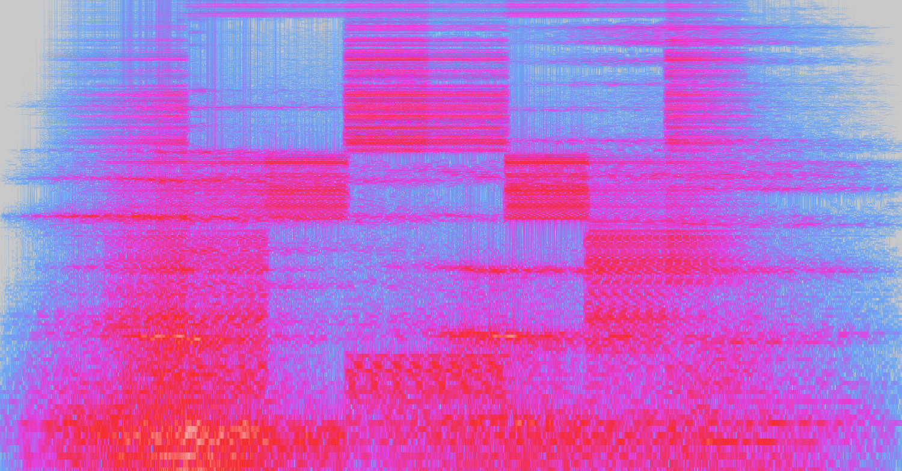
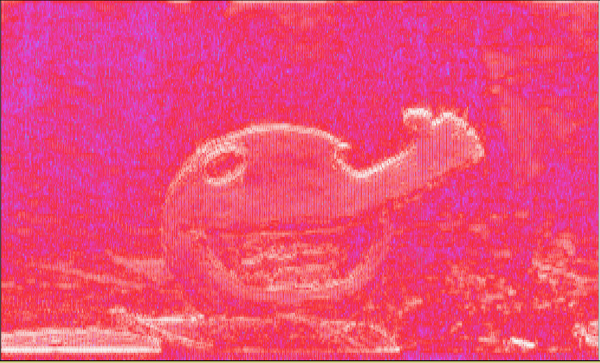

# Audio Steganography!
### Alex Cho, Ian Chen

## What is Audio Steganography?

Audio Steganography acts in a similar fashion to image steganography - storing data through slightly modifying an audio file to hide data in a way that is undetectable by the human ear. This could be done in a multitude of different types of files, from hiding data in the header of a WAV file to creating spectrograms that become visible through applications such as Audacity.

#### Example:

Above was an example of a hidden image of a creeper within the sound files for cave14.ogg, a music file within minecraft.

## Some Uses of Audio Steganography

Audio Steganography has some advantages over Image Steganography. For example, it can be used to spy on a household more stealthily - an Indian advertisement company called SilverPush was able to transmit data from their websites or advertisements on TVs to phones to track users’ habits. By taking advantage of audio files, the company obtained information it would not have been able to without cameras. 

For a more legal example, Amazon modified its Super Bowl commercial for Alexa to have a code hidden in the advertisement to tell Alexa to not trigger when called on by the ad.

## What Files Store Audio?

Files that are:
  - Under file types: WAV, mp3, aiff, ogg, webm, m4a, flac, etc.
  - Usually at least 1KB, but under 10 MB
tend to contain audio.

### Useful codec software
- for interfacing with mp4 (the hardest): ffmpeg, LAME
- for converting between files: you can use vlc as a command line tool
 `vlc -I dummy "example.wav" --sout=#transcode{acodec=mp3,vcodec=dummy}:standard{access=file,mux=raw,dst="example.mp3"}`
- for playing audio files in the terminal: aplay, mpg123, or ffplay
- for downloading from youtube: youtube-dl
- for editing audio, or ripping the audio from a video: audacity

### What is a .wav file?
A Waveform Audio File Format, a.k.a. WAV file, is a file format created by Microsoft and IBM to store audio bitstreams on PCs.

WAV files make use of the Resource Interchange File Format, RIFF, bitstream for storing data in chunks.

### What is a RIFF file?
###### source: https://johnloomis.org/cpe102/asgn/asgn1/riff.html
A RIFF chunk looks like this:
 - Chunk identifier: 64 bits, 8 bytes
 - Size of the data: 64 bits, 8 bytes, 'tis the number of bytes in the data
 - Form type: 4 bytes, 4 letters (can be CPPO, PAL, RDIB, RMID, RMMP, WAVE)
 - The actual data

The data is made of RIFF subchunks that follow the exact same format as above, but without the "form type" field.

### What is a .mp3 file? (Disclaimer! We are not dealing with mp3 files in our steg program.)
###### source: http://blog.bjrn.se/2008/10/lets-build-mp3-decoder.html
###### source: http://www.mp3-tech.org/programmer/frame_header.html
###### source: http://www.datavoyage.com/mpgscript/mpeghdr.htm
Compressed audio using the following facts about audio:
 - Humans can only hear from between 20 kHz and 20 Hz, and depending on the frequency, the sound might have to be very loud even for the person to perceive it.
 - The loudest frequencies ("signals") will drown out quieter ones.
 - Various psychoacoustic models that may be used when *encoding* an mp3 file (but you don't need to know these to decode an mp3 file)

MP3 files work as follows: (If you don't want to deal with all of this, then probably use FFMpeg or LAME for your program.)
 - Fun fact: the ISO specifications for MP3 are proprietary. To view them, you'd have to pay at least 203.09 dollars.
 - There is no header. The MP3 file is built by concatenating frames.
 - They are split into data chunks:
 - - Each chunk has a header, an optional checksum, and the data (which contains exactly 576 samples)
 - - - Headers begin with a hex that looks like: `FFFB7864` (4 bytes, 32 bits)
 - - - - The exact bits are: `11111111111 (2 bits, specify mpeg version) (2 bits, specify layer description) (1 bit, protected by CRC?) (4 bits, the bit rate index, must specify a multiple of 32kbps) (2 bits, sampling rate frequency) (1 bit, are frames padded with a single bit to exactly fit the bit rate?) (1 bit, private bit) (2 bits, channel mode) (2 bits, mode extension) (1 bit, copyrighted?) (1 bit, original media?) (2 bits, emphasis setting)`
 - - The data uses huffman coding (which allows it to be stored in about 1/8 the size). Each atom encoded here represents a number from -8206 to 8206, which can be looked up in a 70 kb Huffman table. The number must be raised to the `4/3` power and multiplied by the desired volume factor. 
 - - - Sometimes the data gets re-ordered for efficiency, so you have to put it back in order.
 - - - This next part is beyond the scope of steganography, but the output is filtered through band passes and transformed by the MDCT (modified discrete cosinte transform).
 - At the end, you get your Audio Tag ID3v1
 - - `3 bytes`: "TAG"
 - - `30 bytes`: Title
 - - `30 bytes`: Artist
 - - `30 bytes`: Album
 - - `4 bytes`: Year
 - - `30 bytes`: Comment
 - - `1 byte`: Genre (ranging from `Blues` to `Dance Hall`)

What is Huffman coding: The idea is that if you know that A will appear more frequently than B than C than D, you can use the following encoding:
 - `A = 0`
 - `B = 10`
 - `C = 110`
 - `D = 111`

### What is a .ogg file?
###### source: https://www.file-recovery.com/ogg-signature-format.htm
###### source: https://fileformats.fandom.com/wiki/Ogg
###### source: https://xiph.org/vorbis/doc/Vorbis_I_spec.html
OGG files are files that can compress as well as, if not better than MP3, and the best part is that the specifications are open-source. So what's in a .ogg file?

.ogg files are split into data packets. Each data packet has the following:
 - A 27 byte header
 - - A tag of 4 bytes: `OggS` (or hex `4F 67 67 53`)
 - - 21 bytes of version, header type, granule position, bitstream serial number, page sequence number, checksum.
 - - 1 byte to indicate the number of segments in the packet, and 1 byte to indicate the size of each segment in bytes.

It's pretty complicated. Just use `libogg` and `libvorbis`, they're open source after all.

### What is a .aiff file?
###### source: http://paulbourke.net/dataformats/audio/
###### source: http://midi.teragonaudio.com/tech/aiff.htm
AIFF (Audio Interchange File Format) files are used to usually store uncompressed pulse-code modulation (PCM). Because of this, these files tend to take up much more space than mp3 files. AIFF Files are commonly found on Apple devices.

AIFF Files require a common chunk, where information about the soundfile, is stored, along with a sound chunk, where the actual audio is stored. The common chunk functions as a header for the audio file and is 26 bytes long.

Within the Sound Chunk is also another header that is 16 bytes long, storing the length of the soundfile and the likes. 

### What is spectrogram steganography?
Spectrogram steganography is a method of hiding images in an audio file which can only be seen by comparing the frequency of the audio to the time. The images hidden within the audio files become visible when using software like audacity. An example of a spectrogram was shown above with the creeper, but here is an example of our own:

By taking the greyscale of the original image and using it to change the frequency, we are able to draw out images on an audio file. 

also tidy up mp3, move aiff to wav, add helpful image diagrams
