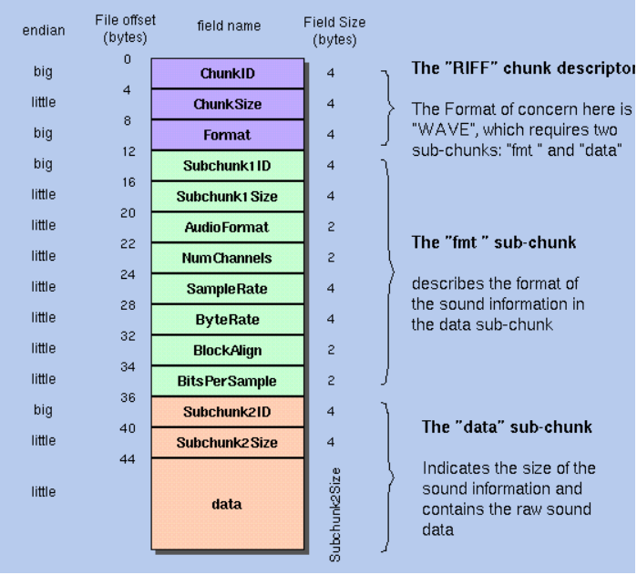
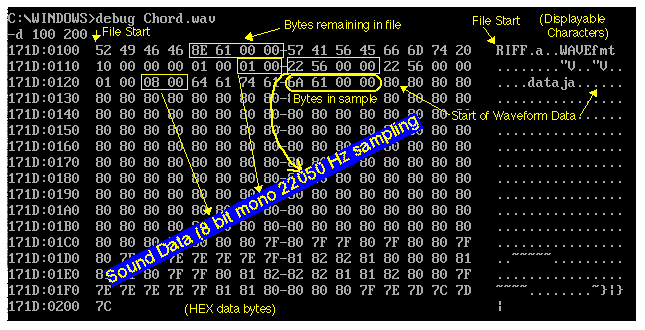
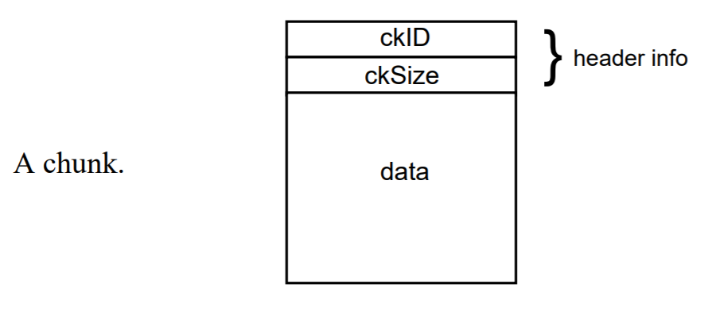
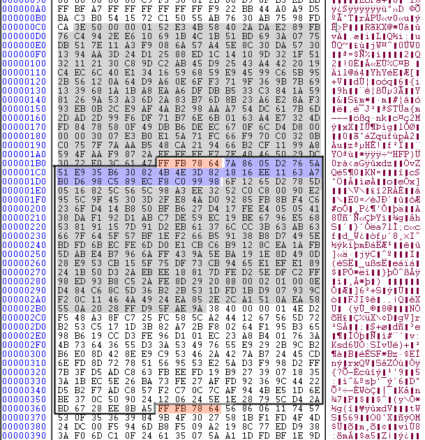
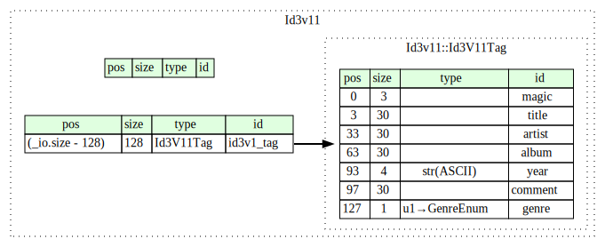
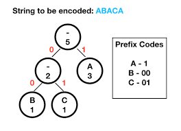
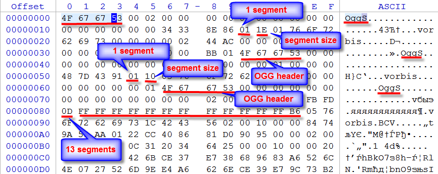

# Audio Steganography!
### Alex Cho, Ian Chen-Adamczyk

## What is Audio Steganography?

Audio Steganography acts in a similar fashion to image steganography - storing data through slightly modifying an audio file to hide data in a way that is undetectable by the human ear. This could be done in a multitude of different types of files, from hiding data between headers of an OGG file to creating spectrograms that become visible through applications such as Audacity.

#### Example:

Above was an example of a hidden image of a creeper within the sound files for cave14.ogg, a music file within minecraft.

## Some Uses of Audio Steganography

Audio Steganography has some advantages over Image Steganography. For example, it can be used to spy on a household more stealthily - an Indian advertisement company called SilverPush was able to transmit data from their websites or advertisements on TVs to phones to track users’ habits. By taking advantage of audio files, the company obtained information it would not have been able to without cameras. 

For a more legal example, Amazon modified its Super Bowl commercial for Alexa to have a code hidden in the advertisement to tell Alexa to not trigger when called on by the ad.

## What Files Store Audio?

Files that are:
  - Under file types: wav, mp3, aiff, ogg, webm, m4a, flac, aac, etc.
  - Usually at least 100KB and under 25 MB.
tend to contain audio.

### Useful codec software
- for interfacing with mp3, m4a, wma, etc. (the hardest): ffmpeg
- for interfacing just with mp3 while staying open-source: LAME
- for converting between files: you can use vlc as a command line tool

 `vlc -I dummy "example.wav" --sout=#transcode{acodec=mp3,vcodec=dummy}:standard{access=file,mux=raw,dst="example.mp3"}`
- to convert an ogg file into wav: oggdec
- for playing audio files in the terminal: aplay, mpg123, or ffplay
- for downloading from youtube: youtube-dl
- for editing audio, or ripping the audio from a video: audacity

### Some important metadata for audio files
- sampling rate (usually ranges from 8000 Hz to 96000 Hz, with the most common being 44100 or 48000 Hz)
- channels (mono, stereo, quadraphonic, surround sound, etc.)
- bit depth (the number of bits for a sample, 8-bit to 32-bit but usually 16-bit)

### What is a .wav file?

A Waveform Audio File Format, a.k.a. WAV file, is a file format created by Microsoft and IBM to store audio bitstreams on PCs.

WAV files make use of the Resource Interchange File Format, RIFF, bitstream for storing data in chunks.

WAV files use lossless compression: WAV files store pulse-code modulation (PCM) (i.e. the value of the waveform at each sample)

### What is a RIFF file?
###### source: https://johnloomis.org/cpe102/asgn/asgn1/riff.html
A RIFF chunk looks like this:
 - Chunk identifier: 32 bits, 4 bytes
 - Size of the data: 32 bits, 4 bytes, number of bytes in the data
 - Form type: 4 bytes, 4 letters (can be CPPO, PAL, RDIB, RMID, RMMP, WAVE)
 - The actual data

The data is made of RIFF subchunks that follow the exact same format as above, but without the "form type" field.

WAV files are just a single chunk with a single header (longer than the RIFF header) at the beginning.

### What is a .aiff file?

###### source: http://paulbourke.net/dataformats/audio/
###### source: http://midi.teragonaudio.com/tech/aiff.htm
AIFF (Audio Interchange File Format) files also usually store uncompressed PCM. Because of this, these files tend to take up much more space than mp3 or ogg files. AIFF Files are commonly found on Apple devices.

AIFF Files require a common chunk, where information about the soundfile, is stored, along with a sound chunk, where the actual audio is stored. The common chunk functions as a header for the audio file and is 26 bytes long.

Within the Sound Chunk is also another header that is 16 bytes long, storing the length of the soundfile and the likes. 

### What is a .mp3 file? (Disclaimer! We are not dealing with mp3 files in our steg program.)
###### source: http://blog.bjrn.se/2008/10/lets-build-mp3-decoder.html
###### source: http://www.mp3-tech.org/programmer/frame_header.html
###### source: http://www.datavoyage.com/mpgscript/mpeghdr.htm

Moving Picture Experts Group (MPEG) made the media formats MPEG-1, MPEG-2, and MPEG-4. Later standards allow more range for  quality and features such as digital rights management. MP3 stands for MPEG-1 Audio Layer 3.

Compressed audio using the following facts about audio:
 - Humans can only hear from between 20 kHz and 20 Hz, and depending on the frequency, the sound might have to be very loud  for the person to even perceive it.
 - The loudest frequencies ("signals") will drown out quieter ones.
 - Various psychoacoustic models that may be used when *encoding* an mp3 file (but you don't need to know these to decode an mp3 file)
 - - Ex: Bark scale (named for Heinrich Barkhausen) which models how frequencies are perceived logarithmically.

MP3 files work as follows: (If you don't want to deal with all of this, FFMpeg or LAME are always fine for your program.)
 - Fun fact: the ISO specifications for MP3 are proprietary. To view them, you'd have to pay at least 203.09 dollars.
 - The MP3 file is built by concatenating frames, each with their own headers.
 - They are split into data chunks:
 - - Each chunk has a 4-byte header (always start with `FF`), an optional checksum, and the data (which contains exactly 576 samples).
 - - The data uses huffman coding (which allows it to have ~87% space saving). Each atom encoded here represents a number from -8206 to 8206, which can be looked up in a 70 kB Huffman table. The number is also raised to the `4/3` power and multiplied by the desired volume factor (because of logarithmic frequency bands).
 - - - Sometimes the data gets re-ordered inside the chunk for efficiency, so you have to put it back in order.
 - - - The output is filtered through band passes and transformed by the MDCT (modified discrete cosine transform).

 - At the end, you get your Audio Tag ID3v1
 - - `3 bytes`: "TAG"
 - - `30 bytes`: Title
 - - `30 bytes`: Artist
 - - `30 bytes`: Album
 - - `4 bytes`: Year
 - - `30 bytes`: Comment
 - - `1 byte`: Genre (ranging from `Blues` to `Dance Hall`)

What is Huffman coding: The idea is that if you know that A will appear more frequently than B than C than D, you can use the following encoding:
 - `A = 0`
 - `B = 10`
 - `C = 110`
 - `D = 111`

### What is a .ogg file?
###### source: https://www.file-recovery.com/ogg-signature-format.htm
###### source: https://fileformats.fandom.com/wiki/Ogg
###### source: https://xiph.org/vorbis/doc/Vorbis_I_spec.html

OGG files are files that can compress as well as, if not better than MP3, and the best part is that the specifications are open-source. So what's in a .ogg file?

.ogg files are split into data packets. Each data packet has the following:
 - A header with (27 + number of segments) bytes
 - - A tag of 4 bytes: `OggS` (or hex `4F 67 67 53`)
 - - 21 bytes of version, header type, granule position, bitstream serial number, page sequence number, checksum.
 - - A byte to indicate the size of each segment in the packet.

The rest of the data is encoded in ways similar to mp3. (If you don't want to write your own implementations, probably look into `libogg` or `libvorbis`.) They also use MDCT and Huffman coding, but they also involve residue vectors and have more information stored in the headers.

We couldn't figure out these specifications, but the most relevant piece of information is that OGG files are designed to prevent corruption by allowing the decoder skip to the next header of `OggS` if the chunk it's on is unreadable.

Our steganography inserts data between each of the ogg data chunks, so it's not read by OGG decoders.

### What is spectrogram steganography?
Spectrogram steganography is a method of hiding images in an audio file which can only be seen by comparing the frequency of the audio to the time. The images hidden within the audio files become visible when using software like audacity. An example of a spectrogram was shown above with the creeper, but here is an example of our own:

 - x-axis: time
 - y-axis: frequency
 - color: amplitude of that frequency (when audio is decomposed into its constituent frequencies)

By taking the greyscale of the original image and using it to change the frequency, we are able to draw out images on an audio file. 

Our program splits each x-column of the image and assigns it a time segment. For each time segment, it loops through each pixel in that column and calculates a list of amplitudes (based on the color) and frequencies (based on the position in the image). It then calculates a sum of sin functions over the times in the .wav file.
